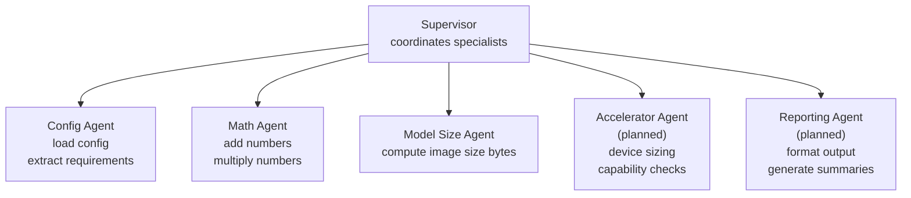

# Runtimes Deployment Agent

[](https://opensource.org/licenses/Apache-2.0)
[](https://www.python.org/downloads/)
[](https://github.com/astral-sh/uv)
[](https://python.langchain.com)

Supervisor-driven orchestration for analysing model-car configurations and other accelerator related tasks. The project demonstrates LangChain’s refreshed supervisor pattern by coordinating focused “specialist” agents from a single entry point.

## Features

- **Supervisor pattern, LangChain 1.x style** – Uses `create_agent` for both the specialists and the supervisor, matching the latest LangChain documentation.
- **Configuration specialist** – Loads model-car YAML files and extracts accelerator requirements as structured JSON.
- **Math specialist** – Handles arithmetic requests (useful for quick sanity checks while keeping the multi-agent wiring easy to validate).
- **Model size specialist** – Computes container image sizes for each model in a configuration.
- **Planned specialists** – Accelerator and reporting agents are scaffolded in the architecture so additional tooling can snap in without changing the supervisor.
- **Single entry script** – `execute_agent.py` runs sample requests and prints the supervisor’s final answer.

## Requirements

- Python **3.12** (or newer)
- A Google Gemini API key (`GEMINI_API_KEY`) for `langchain-google-genai`
- Dependencies listed in `pyproject.toml`

## Quick Start

```bash
# Install dependencies (editable install recommended while iterating)
uv pip install -e .

# Export your Gemini API key
export GEMINI_API_KEY="your-key-here"

# Run the sample workflow
python execute_agent.py
```

You should see three sections in the output: mathematics, configuration requirements, and model image sizes for the sample `config-yaml/sample_modelcar_config.yaml`.

## Architecture



- Each specialist is built with `create_agent`, exposing high-level tools (`analyze_model_config`, `solve_math`) that the supervisor can call.
- The supervisor itself is another `create_agent` instance that chooses the correct specialist, optionally chaining multiple tools, and then returns a concise final response.

## Repository Layout

```
.
├── execute_agent.py                # Sample runner invoking the supervisor
└── src/
    ├── agent/
    │   ├── llm_agent.py            # Supervisor wiring + registry
    │   └── specialists/
    │       ├── __init__.py              # Specialist descriptor
    │       ├── config_specialist.py     # Builds config-focused agent + tool
    │       ├── math_specialist.py       # Builds math-focused agent + tool
    │       └── model_size_specialist.py # Computes container image sizes
    └── config/
        └── model_config.py         # YAML loading + requirement extraction helpers
```

## Customising

- **Add new specialists**: drop a new builder in `src/agent/specialists/` and register it inside `LLMAgent._initialise_specialists`.
- **Change the model**: pass a different `model` string when instantiating `LLMAgent`.
- **Direct invocation**: the helper method `extract_final_text` returns the supervisor’s final response if you need it programmatically.

## Testing

A minimal smoke test is included via `python -m compileall src execute_agent.py`, ensuring the codebase remains syntax-valid. Add pytest-based tests under `tests/` as the project grows.

## License

Licensed under the [Apache License 2.0](LICENSE).
