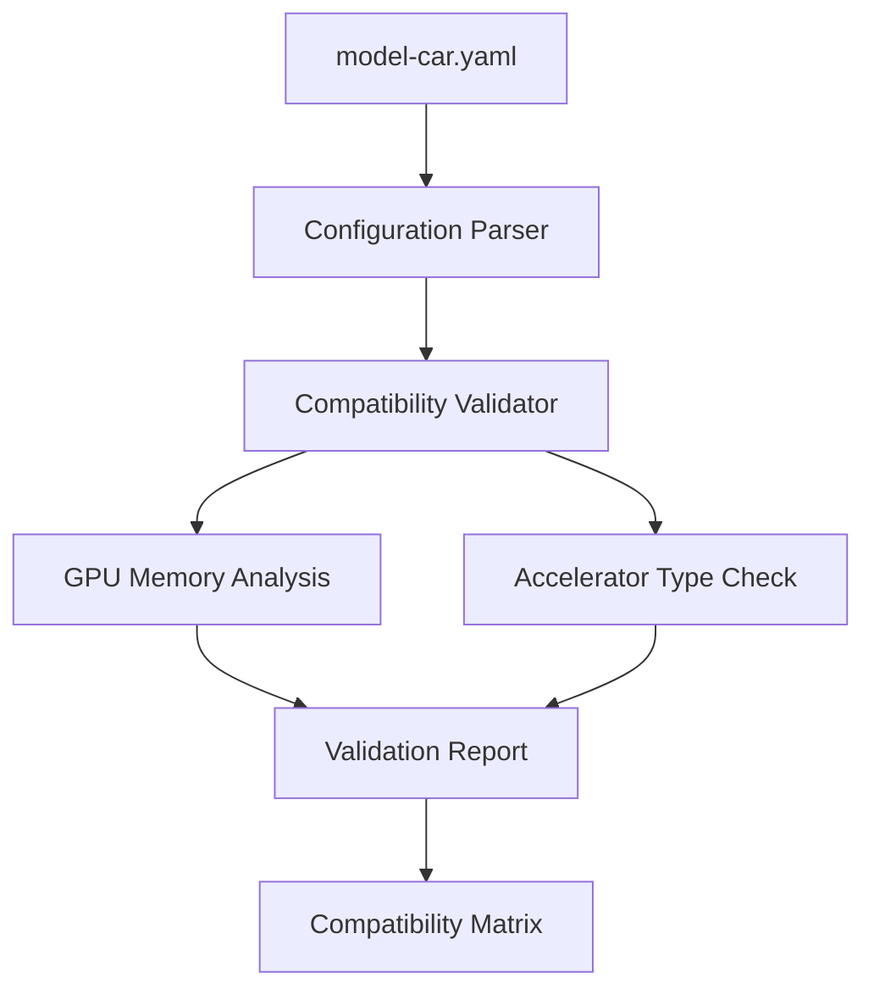

# Accelerator Compatibility Agent

[](https://opensource.org/licenses/Apache-2.0)
[](https://www.python.org/downloads/)
[](https://github.com/astral-sh/uv)
[](https://www.redhat.com/en/technologies/cloud-computing/openshift/openshift-ai)

<div align="center">
  
</div>

An intelligent agent for validating and managing model-accelerator compatibility in Red Hat OpenShift AI deployments. The agent ensures optimal matching between AI/ML models and available hardware accelerators.

## Overview



## Core Functions

- Parse and validate model-car configurations
- Analyze accelerator requirements (CUDA, ROCm, vLLM-Spyre-x86 etc.)
- Verify GPU capacity and memory compatibility
- Generate compatibility reports
- Skip unsupported model-accelerator combinations

## Project Structure

```
.
├── src/
│   ├── agent/
│   │   └── llm_agent.py         # Main LLM agent orchestrator
│   ├── config/
│   │   ├── model_config.py      # Configuration parser
│   │   └── model-car.yaml       # Master model configuration
│   ├── validators/
│   │   └── accelerator_validator.py  # Compatibility validators
│   └── reports/
│       └── validation_report.py  # Validation report generator
└── tests/
    └── test_llm_agent.py        # Test suite
