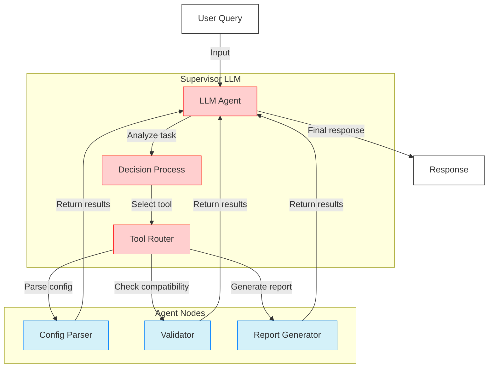
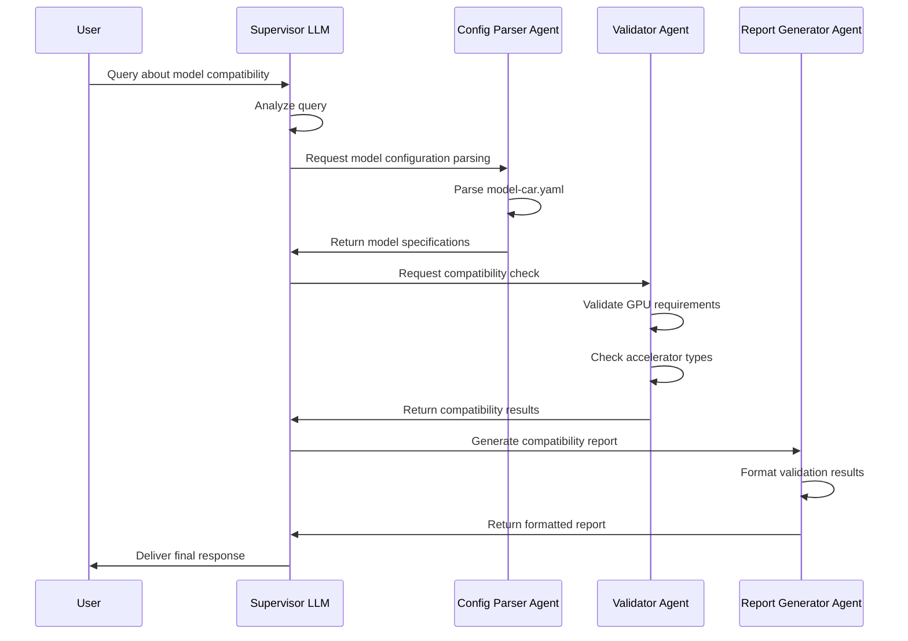
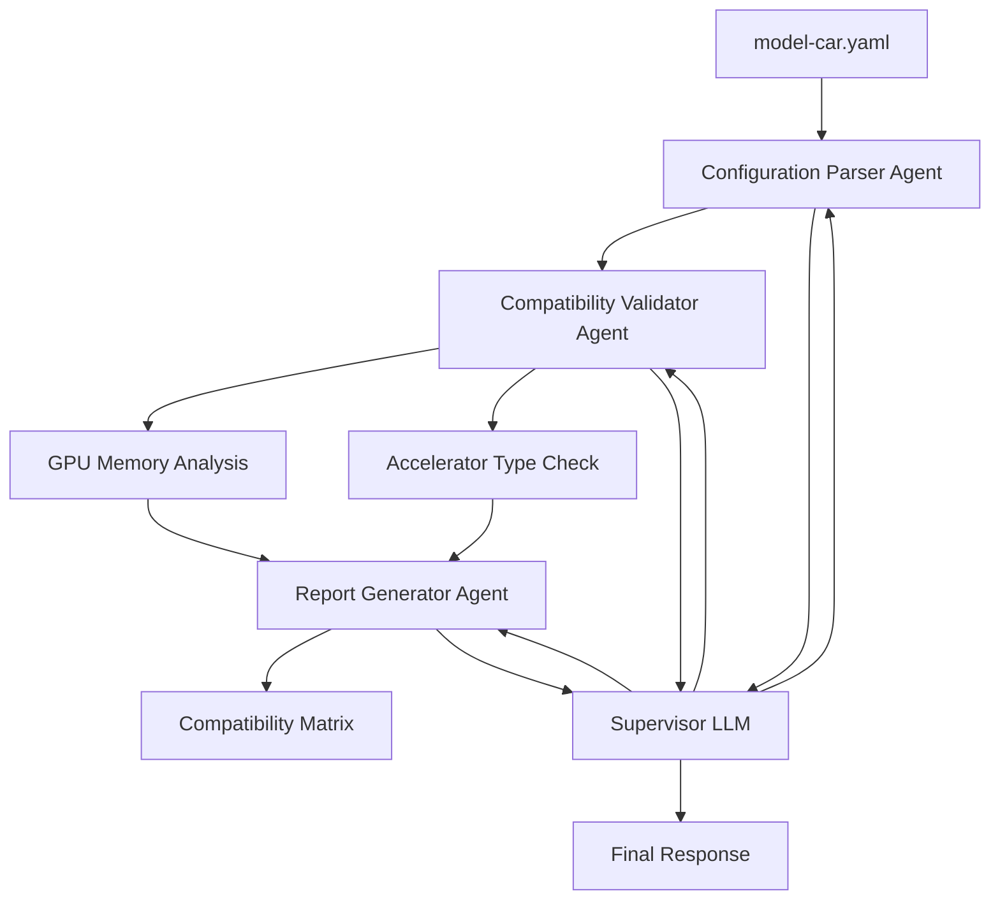
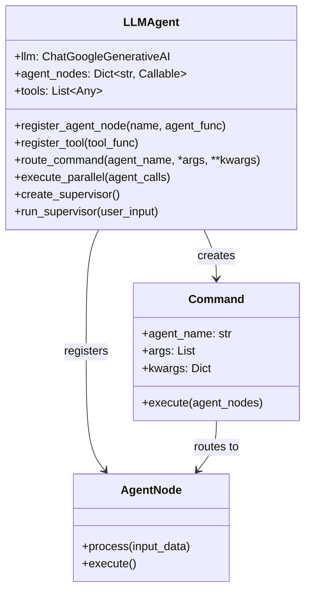

# Accelerator Compatibility Agent

[](https://opensource.org/licenses/Apache-2.0)
[](https://www.python.org/downloads/)
[](https://github.com/astral-sh/uv)
[](https://langchain-ai.github.io/langgraph/)
[](https://www.redhat.com/en/technologies/cloud-computing/openshift/openshift-ai)

<div align="center">
<pre>
╔═══════════════════════════════════════════════════════════════╗
║                                                               ║
║             Accelerator Compatibility Agent                   ║
║                                                              ║
║      Validating Model-Accelerator Compatibility in RHOAI     ║
║                                                              ║
╚═══════════════════════════════════════════════════════════════╝
</pre>
</div>

An intelligent agent for validating and managing model-accelerator compatibility in Red Hat OpenShift AI deployments. The agent ensures optimal matching between AI/ML models and available hardware accelerators.

## Multi-Agent Architecture

This project implements a Supervisor-based multi-agent architecture inspired by [LangGraph's multi-agent approach](https://langchain-ai.github.io/langgraph/concepts/multi_agent/). The system consists of:

- **Supervisor Agent**: A central LLM-powered agent that coordinates workflows and makes high-level decisions
- **Specialized Agent Nodes**: Task-specific agents focused on configuration parsing, compatibility validation, and reporting
- **Command Routing**: Uses the Command pattern to route execution between agent nodes based on the supervisor's decisions

### Supervisor Architecture



This architecture provides several advantages:
- **Modularity**: Separate agents make the system easier to develop and maintain
- **Specialization**: Each agent focuses on a specific domain
- **Control**: The supervisor explicitly controls agent communication
- **Flexibility**: Supports both sequential and parallel agent execution

### Execution Flow



## Agent Workflow



## Core Functions

- Parse and validate model-car configurations
- Analyze accelerator requirements (CUDA, ROCm, vLLM-Spyre-x86 etc.)
- Verify GPU capacity and memory compatibility
- Generate compatibility reports
- Skip unsupported model-accelerator combinations

## Implementation Details

The agent system is built using the Supervisor pattern where:

- The LLM acts as the supervisor that decides which specialized agent to call
- Agent nodes are implemented as tools that the supervisor can invoke
- Communication happens through a shared state that passes between agents
- The Command pattern routes execution to the appropriate agent based on the supervisor's decision

### Command Routing Mechanism



This architecture supports both sequential agent execution and parallel processing, making it suitable for complex workflows.

## Project Structure

```
.
├── src/
│   ├── agent/
│   │   └── llm_agent.py         # Supervisor LLM agent orchestrator
│   ├── config/
│   │   ├── model_config.py      # Configuration parser agent
│   │   └── model-car.yaml       # Master model configuration
│   ├── validators/
│   │   └── accelerator_validator.py  # Compatibility validator agent
│   └── reports/
│       └── validation_report.py  # Report generator agent
├── execute_agent.py             # Main entry point for running the agent
└── tests/
    └── test_llm_agent.py        # Test suite
